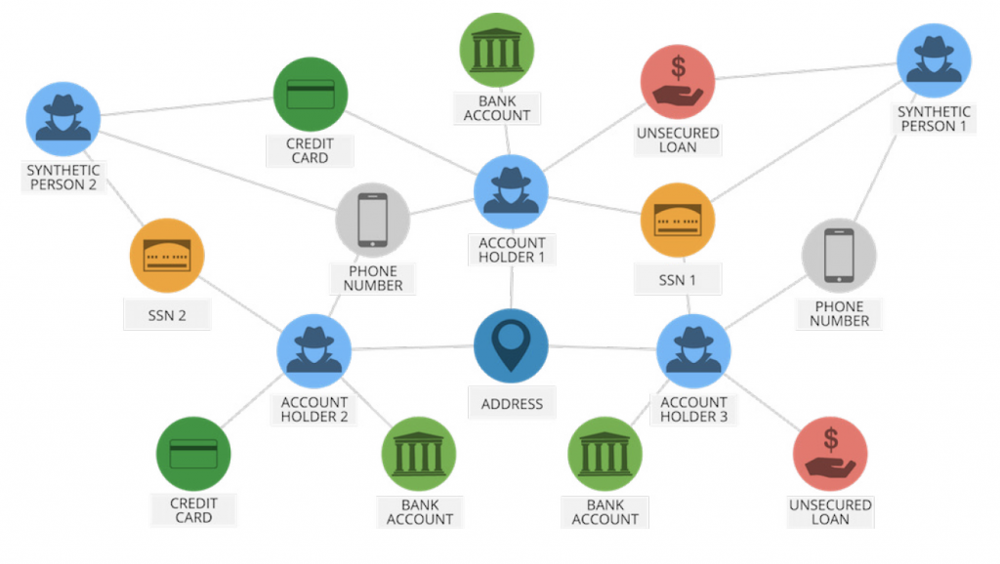

# 图技术助力企业打击商业欺诈

作者：**方俊强** - Neo4j大中华区总经理

每年企业因欺诈所承受的损失可达数百万美元。根据普华永道的数据，自2020年以来，近一半的企业组织都经历过腐败、欺诈或其他经济犯罪。随着管理者对风险防范与控制意识的提升，越来越多的企业采用图技术构建应用系统，解决欺诈关联问题，以便更好地实现企业目标。

图技术的优势在于将数据之间的关系作为优先级，使用图数据库可直观显示，对于高度互连、数据量庞大、数据种类繁多以及需要对复杂查询作出快速响应的分析非常有效。作为全球图数据平台的领导者，Neo4j图数据平台可以轻松对复杂关系进行建模、存储和处理，并识别隐藏在传统表格数据集中的模式和洞察。Neo4j图数据平台优异的可扩展性、全面的图算法和强大的图分析能力在欺诈调查速度、欺诈识别效率和风险传导管理等方面极具优势。

Neo4j大中华区总经理方俊强

## 挑战日益加剧——网络成为欺诈新阵地

据中国司法大数据研究院8月相关报告数据显示，2017年至2021年，全国各级法院一审审结的涉及信息网络犯罪案件共计28.20万余件，案件量呈逐年上升趋势，其中诈骗罪案件量占比最高，为36.53%，信息网络犯罪案共涉及66万余名被告人。

数字平台为欺诈创造了新的机会，复杂的交易网络可使用复杂的分层技术来掩盖当事人。大量小额交易通过代理、公司和金融机构组成的迷宫进行，使得调查人员很难开展资金追踪。

随着疫情引发的数字化热潮，许多现有的制衡机制没有及时更新。离线工作系统和流程不再适用于在线世界。互联网无国界的特性使经济实体可以轻松访问其他国家，且不受限于这些国家的管辖范畴和执法范围。

## 应对策略核心——速度至关重要

速度对于检测欺诈和防止其传播至关重要。但当前的欺诈检测工具无法应对如今数百万笔交易和涉及的各方。一些机构已经转向自动化、人工智能、机器学习和自然语言处理 (NLP)，但这些工具的效果也仅与提供的数据大同小异。

问题在于，使用现有的取证方法，数据存储在使用以单元格（列和行）展示的传统关系型数据库系统中，只能关联两条数据。这意味着无法检测到可能表明异常行为的关键模式和关联。

随着业务流程加速且更自动化，检测欺诈的时间范围正在缩小。实时解决方案变得至关重要。Neo4j知识图谱寻找隐藏在复杂关联事件中的模式，在更短的时间内以可扩展的方式从具有复杂上下文情景的大量数据中获取有价值的信息，用户可以对基础数据进行推理并自信地使用其进行复杂的决策。

## 识别可疑链接

调查人员越来越多地采用图数据科学。这是一种完全不同的存储和管理数据的方式，使用节点和链接的图来表示它们之间的关系。这增加了诸如“交易于”或“注册于”之类的关键上下文情景，有助追踪关联人员。

借助Neo4j知识图谱，可以直观地识别人的线索和欺诈圈。根据某人与可疑实体关系的质量、数量和距离生成“有罪关联”分数。随着时间的推移，这些图变得更加有用。一旦生成了欺诈环的模式，相似性算法就可以使用该模式来检测其他潜在的欺诈圈及其参与者。

## 精准预测与高效预防

保险业是最容易受到欺诈的行业之一。德勤警告称，由于保险业务模式的数字化，自疫情以来，保险业的网络风险正在增加。传统上，保险公司使用基于规则的软件来尝试分析数十万个索赔，其中高达10%的索赔可能是捏造或夸大的，具体取决于类别。

苏黎世瑞士是苏黎世保险集团的一部分，最初成立由25名现场调查员组成的团队，负责调查潜在的欺诈案件。但是由于自动生成的报告数量过大而无法处理。为了更有效地进行分类，苏黎世转向了图数据平台。调查人员现在已经从基于规则的风险工具转向基于图的应用程序，该应用程序存储了大约 2000 万个节点和3500万个关系。他们可以筛选并快速识别大量信息中的任何问题。该图可以立即显示争议中的各方是否有关联，特别是故意撞车骗保的交通事故。

## 有效保护供应链

供应链庞大而广泛，供应商网络深厚而且涉及的交易数量巨大，很容易受到欺诈的影响。其中一个场景就是食品丑闻，合格产品被更便宜、劣质或假冒产品所替代。正如毕马威所观察到的，“在当今全球市场中，串通回扣、贿赂和腐败以及操纵投标的行为越来越普遍，而且越来越难以被发现”。

采购平台Transparency-One尝试开发一个基于传统列和行数据库的可视化平台，该平台使用SQL（结构化查询语言）来查询数据。其目的是确保可追溯性并使用户能够搜索受特定原材料或设施问题影响的任何产品。

但是信息数量和结构对于该平台来说实在太多，无法快速处理。Transparency-One因此转移到了图数据平台。它能够分析数千种不同的产品，并在几秒钟内生成结果。制造商和品牌所有者可以了解、监控、分析和搜索他们的供应链，并共享有关生产场所和产品的重要数据。

传统技术无法检测精心设计的欺诈圈或大量可疑活动，与之相比，可存储更丰富、更深入数据的图数据科学能够实现实时分析和欺诈预防，为组织节省数百万美元。

越来越多的公司将在数字优先经济中面临更严峻的欺诈挑战，需要以更大的敏捷性扩展解决方案流程。图技术在处理关系复杂数据上的优势有目共睹，国内外各行各业如火如荼地开展图技术的探索和应用，其未来前景也将大放异彩。