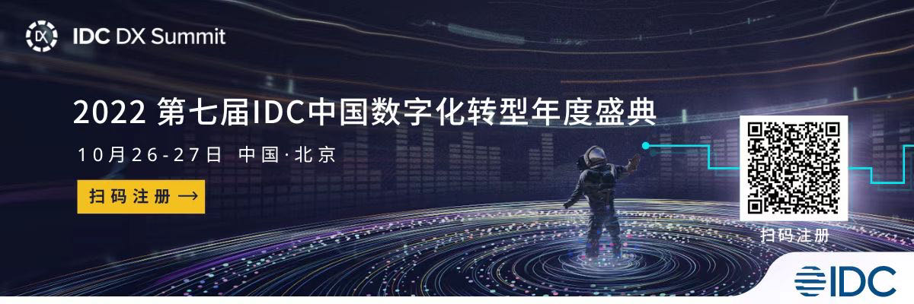
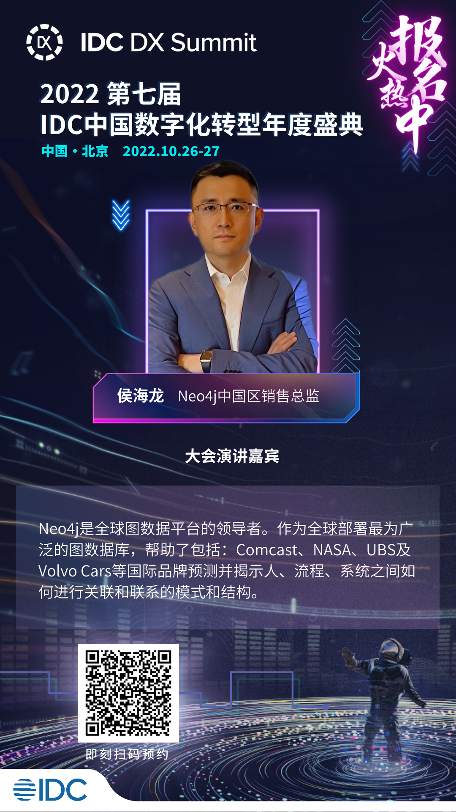

# Neo4j 将出席 2022 第七届IDC中国数字化转型年度盛典

报名地址：https://my.31huiyi.com/pc/page/d6670000-96a5-3a0b-e38a-08da73a06375?cc=GONGZHONGHAO

今年 Neo4j 将再次出席IDC中国数字化转型年度盛典，我们诚挚邀请您共同参与，扫下图二维码或文末“阅读原文”即可到达专属邀请报名页面。

我们期待与您在现场交流。

也可以看看我们去年的回顾短视频。

## 会议简介

立足数字星河，放眼浩瀚宇宙。2022 第七届IDC中国数字化转型年度庆典将于10月26日至27日在北京隆重举办！

今年，IDC以音乐为题，围绕“优化创新”，“颠覆创新”，“和谐创新”三个核心关键词，希望每一个音符、每一个演奏者、每一个乐队放在一起的时候都能够共同奏响“数字化优先下的和谐乐章”，相信这也是每个企业、行业、产业、地区，甚至是国家都希望看到并实现的数字化转型之梦。

在本次盛典的主论坛环节中，IDC中国区总裁霍锦洁女士，清华大学教授、英国国家社会科学院院士关大博教授，以及IDC中国区副总裁兼首席分析师武连峰先生将分别针对全球数字化经济发展、双碳与气候变化、中国数字化优先发展趋势以及国内ICT市场关注等话
题发表主题演讲。同期举行的六场分论坛（包括：未来体验，多云时代，未来数字基础架构，未来智能，未来城市，未来应用与软件） 也将国绕诸多热点议题展开分享和交流。

此外，IDC中国已正式公布108个2022 IDC中国未来企业大奖优秀案例名单。我们将在现场颁发优秀奖奖杯，同时揭晓2022 IDC中国未来企业大奖卓越奖名单，敬请关注。

特此邀请，期待您的莅临与参与！

—— 2022第七届1DC中国数字化转型年度盛典组委会

## 会议时间

2022年10月26-27日 09:00-18:30

## 会议地点

北京嘉里大酒店 二层宴会厅

## Neo4j 演讲嘉宾

## Neo4j 展台

本次我们也会在会议期间设置展台，用来与参会者进行现场面对面交流，非常欢迎您的光临。

欢迎点击“阅读原文”报名本次盛典，也期待与您在Neo4j展台现场交流。

