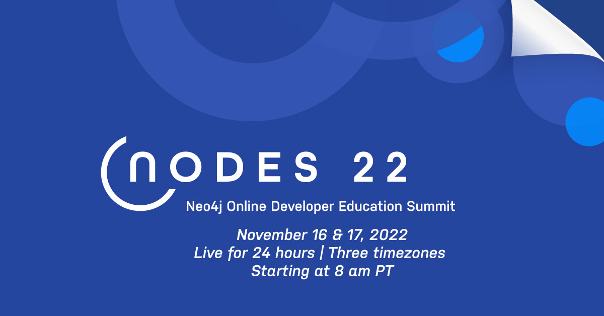
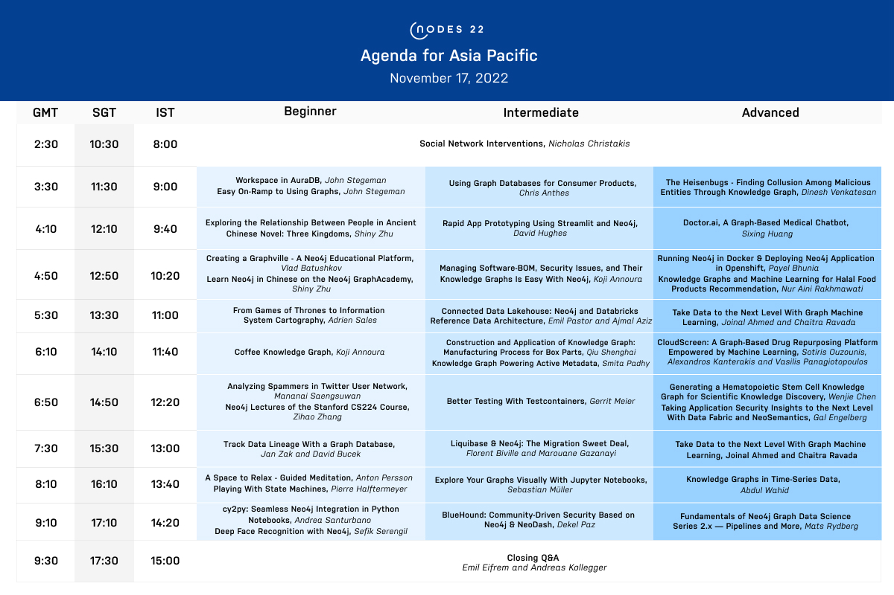
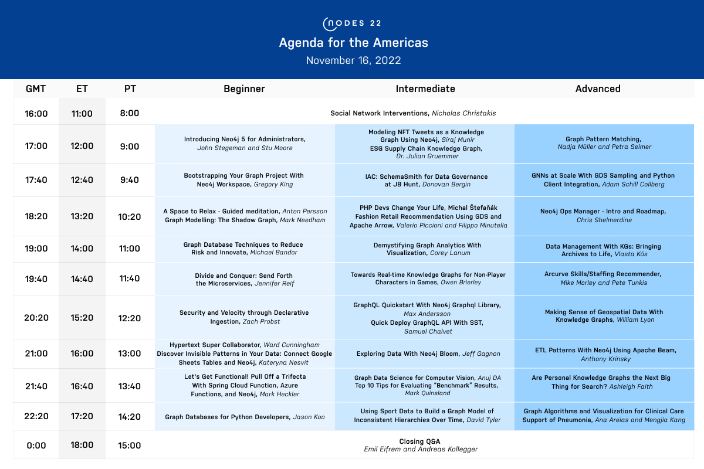
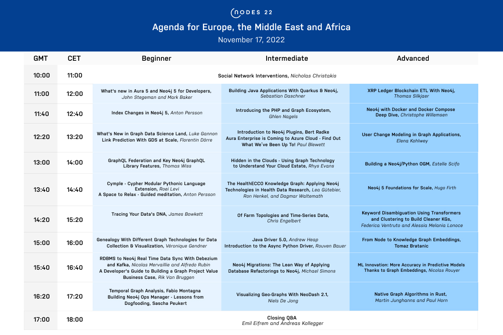

# Neo4j 开发者大会 NODES 2022 活动日程已发布

各位 Graphistas：

Neo4j 开发者大会 NODES 2022 将在2022年11月16～17日召开，不要错过这连续24小时跨越3个主要时区的大型在线活动，欢迎加入我们一起庆祝来自全球图技术社区的隆重分享。

现在访问官方网站注册活动：<http://neo4j.com/nodes-2022/>

## 什么是 NODES

NODES 是 Neo4j Online Developer Education Summit 的缩写，是 Neo4j 的年度开发者大会。我们邀请来自世界各地图技术社区的专家们，为参会者带来包括核心产品、开发者工具和库的深入研究、来自用户和合作伙伴以及开源的项目等议题分享。我们诚挚邀请大家聚集在一起，讨论图技术世界中发生的事情，分享技巧和窍门，并与世界各地的 Graphistas 线上见面和互相学习。

NODES 2022 将是一场跨时区的持续24小时的线上活动，无论你是图技术的初学者，还是图领域的专家，都能从超过100场的分享中找到你的兴趣。无论你是刚刚听说过图，还是想要学习最佳实践，在这里有适合所有人的东西：图无处不在。

## 不容错过的开场演讲

我们的主讲人，著名的耶鲁大学教授尼古拉斯-克里斯塔基斯（Nicholas Christakis），将以对社会网络的深入研究拉开NODES 2022的序幕。你将了解到网络如何被用来创造一个改变整个人群行为的临界点，他甚至会用一个实验向我们展示如何做到这一点。

## NODES 2022 亚太区活动日程

亚太区的活动将在11 月 17 日开始，将从主讲人 Nicholas Christakis 的开场演讲开始，他将讨论社交网络对人口行为的影响。

你将有机会看到多位图专家带来关于图技术的独特观点。

*Chaitra Ravada 和 Joinal Ahmed*：**使用图机器学习将数据提升到新的水平**

他们将讨论为什么图机器学习比传统的机器学习方法更有意义，并向您展示图机器学习如何为**推荐系统**、**欺诈检测**等用例提供支持。他们还将教你如何构建由 Neo4j 提供支持的欺诈检测解决方案，以及如何在云上部署基于图的机器学习模型。

*黄思行*：**Doctor.ai —— 一个基于图的医疗聊天机器人**

知识图谱很普遍，尤其是在医学和医疗保健领域 —— 但到目前为止，只有专家才能操作它们。自然语言聊天机器人可以改变这一点。我们开发了一个名为 Doctor.ai 的云原生医疗聊天机器人，由 Neo4j 支持。我们可以使用 AWS Lex、GPT-3 或 Alan AI 作为自然语言理解引擎。

*Dekel Paz*：**BlueHound —— 基于 Neo4j 和 NeoDash 的社区驱动的安全性**

BlueHound 是一种新的开源网络安全工具，最初的灵感来自 NeoDash - Neo4j 的仪表板构建工具，它有助于为图数据创建可视化。 BlueHound 通过添加数据收集功能、查询执行和缓存、结果导出以及许多新图表和功能来帮助防御团队查明安全问题。

在三个不同的会场中，你还将有机会聆听其他知名演讲者的演讲，例如 Nur Aini Rakhmawat、Koji Annoura、Joinal Ahmed、和 Jan Zak。

### 不容错过的国内讲师

特别感谢来自国内的多位专家的演讲申请，我们在分析和考虑了多种因素下，不得不有一些取舍，最终选定了部分演讲。

*黄思行*：**Doctor.ai —— 一个基于图的医疗聊天机器人**

*邱胜海*：**知识图谱的构建与应用——箱体零件的制造过程**

*陈文杰*：**为科学知识发现生成造血干细胞知识图谱**

*张子豪*：**斯坦福CS224和Neo4j介绍**

> 我们向所有提交演讲的讲师们表示由衷的感谢，是大家的支持才让我们的社区成长壮大。

## NODES 2022 美加区活动日程

## NODES 2022 欧洲区活动日程

## 报名开放中

活动日程可能还有一些调整，请大家持续关注我们获得最新动态。

我们正在紧张推广本次活动，也欢迎加入我们一起邀请朋友来报名参会。将有机会获得现金奖励。详情可参考博客文章。

我们活动日不见不散！

> 关于 Neo4j

Neo4j 是世界领先的图数据平台。Neo4j 提供实时交易处理、先进的人工智能和机器学习以及直观的数据可视化等关联数据解决方案。我们帮助Comcast、NASA、瑞银集团和沃尔沃汽车等企业，捕获真实环境里丰富的数据上下文关系，从而解决任何规模的挑战。我们的客户通过遏制金融欺诈和网络犯罪、优化全球网络、加速突破性研究及提供更优推荐来实现其行业变革。

请访问官网 https://neo4j.com 了解更多信息。欢迎通过邮件**china@neo4j.com**与 Neo4j 中国团队取得联系。