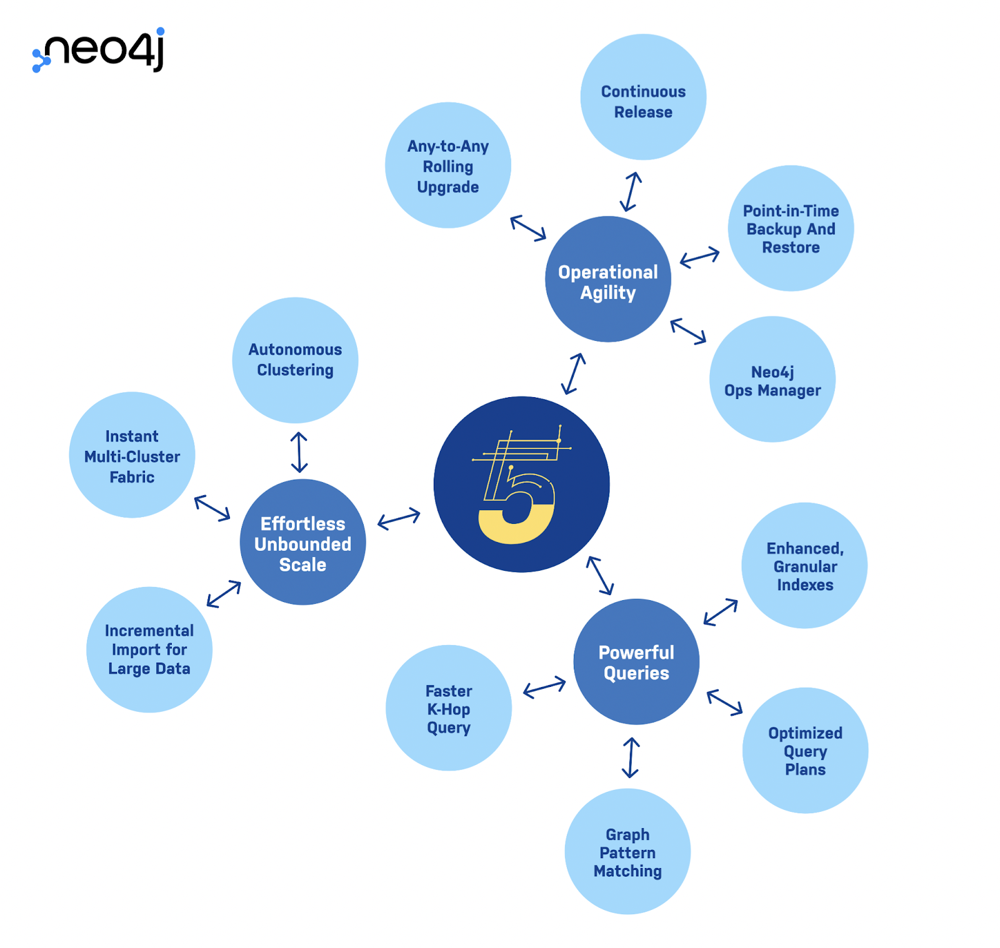

# Neo4j 宣布下一代图数据平台 Neo4j 5 上线

> 增强的可扩展性、敏捷性、高效率和性能优势使企业能够在任何环境中更快、更轻松地创建和部署智能应用程序。

中国北京，2022年11月10日 —— 图技术的领导者 Neo4j Ⓡ 今天宣布了下一代可用于云端的图数据平台 Neo4j 5 上线。在传统数据库的基础上，扩大了原生图的性能优势，同时在本地、云、混合云或多云部署中实现更高可扩展性，从而使企业能够更快地创建和部署智能应用程序，并从数据中获取更大价值。

## 核心特性一览

### 更敏捷地运维

- 任意版本滚动升级

- 持续发布

- 差异备份和恢复

- Neo4j OPS Manager

### 更轻松地无缝扩展

- 自动集群

- 即时多集群Fabric

- 大规模数据增量导入

### 更强大的查询

-  增强的索引

-  优化的查询计划

-  图模式匹配

-  更快的 K 跳查询

Neo4j 联合创始人兼首席执行官 Emil Eifrem 表示：“随着企业开始寻求更好的方法利用数据连接来大规模地解决复杂问题，图技术的应用正在加速。Neo4j 5 提供更高可扩展性、敏捷性和性能的新平台，帮助企业进一步突破局限，挖掘其数据和业务的潜能。”

## Neo4j 5的专属优势

查询语言更强大，速度提升1000倍。新的语法使编写复杂的模式匹配查询变得更加容易。索引、查询计划和运行时间的改进使Neo4j 5能够实现有史以来最快查询。例如，Neo4j 5在执行多跳查询时比Neo4j 4要快1000倍。这些改进对Neo4j的图查询结果进行了优化，与传统数据库相比，查询速度得到了极大提升。利用这些优势，企业能够获得更加实时的大规模查询结果。

在数百台机器上进行自动扩展，使自我管理的客户基本无需手动，投入较小的基础架构成本即可增长和处理大量查询。利用这一优势，企业借助自主分类和结构化处理等新功能，能够有效地操作非常大的图并在任何环境中扩展。Neo4j 5还可以自动对计算资源进行分配和再分配。

所有部署的连续更新，包括云、多云、混合云或本地部署。Neo4j 5可确保自我管理和由Neo4j管理的Aura工作负载之间的持续兼容性。此外，被称作Neo4j Ops Manager的新工具提供了一个统一的单窗格，以轻松监测和管理全球部署，从而使客户完全控制其环境。

Neo4j 5可在 https://neo4j.com/download-center 下载以及在 AWS、微软和谷歌云计算平台上直接使用。

## Neo4j 5性能优势为行业设定了新标杆

超过1,300家企业和机构信任Neo4j的技术，应用Neo4j图数据平台管理至关重要的任务应用程序，保持性能、安全性和数据完整性。在企业图数据急剧爆炸式增多的形势下，Neo4j 5进一步帮助企业和机构扩展其领先地位。

Adobe 高级软件工程师兼 Devrant 联合创始人与工程负责人David Fox说：“对于我们而言，切换到Neo4j图数据平台是一个巨大的胜利。我们已经看到了性能显著提高，复杂性、存储和基础设施成本都大大降低。工作人员现在专注于改善基础设施，而无需花时间地进行底层细节的管理。”

## 关于 Neo4j

Neo4j是全球图数据平台的领导者。我们帮助包括康卡斯特(Comcast)、美国宇航局(NASA)、瑞银(UBS)和沃尔沃汽车(Volvo Cars)等客户，捕捉数据中隐藏的现实世界丰富的上下文情境，以应对任何规模的挑战。我们的客户通过遏制金融欺诈和网络犯罪、优化全球网络、加速突破性研究和提供更好的建议来改变其所在的行业。Neo4j提供实时交易处理、先进的AI/ML、直观的数据可视化等支持。欲获得更多信息请浏览 https://neo4j.com。

---

© 2022 Neo4j, Inc.、Neo Technology®、Neo4j®、Cypher®、Neo4j® Bloom™、Neo4j Graph Data Science Library™ 和 Neo4j® Aura™ 是 Neo4j, Inc. 的注册商标或商标。所有其他商标归各自公司所有。