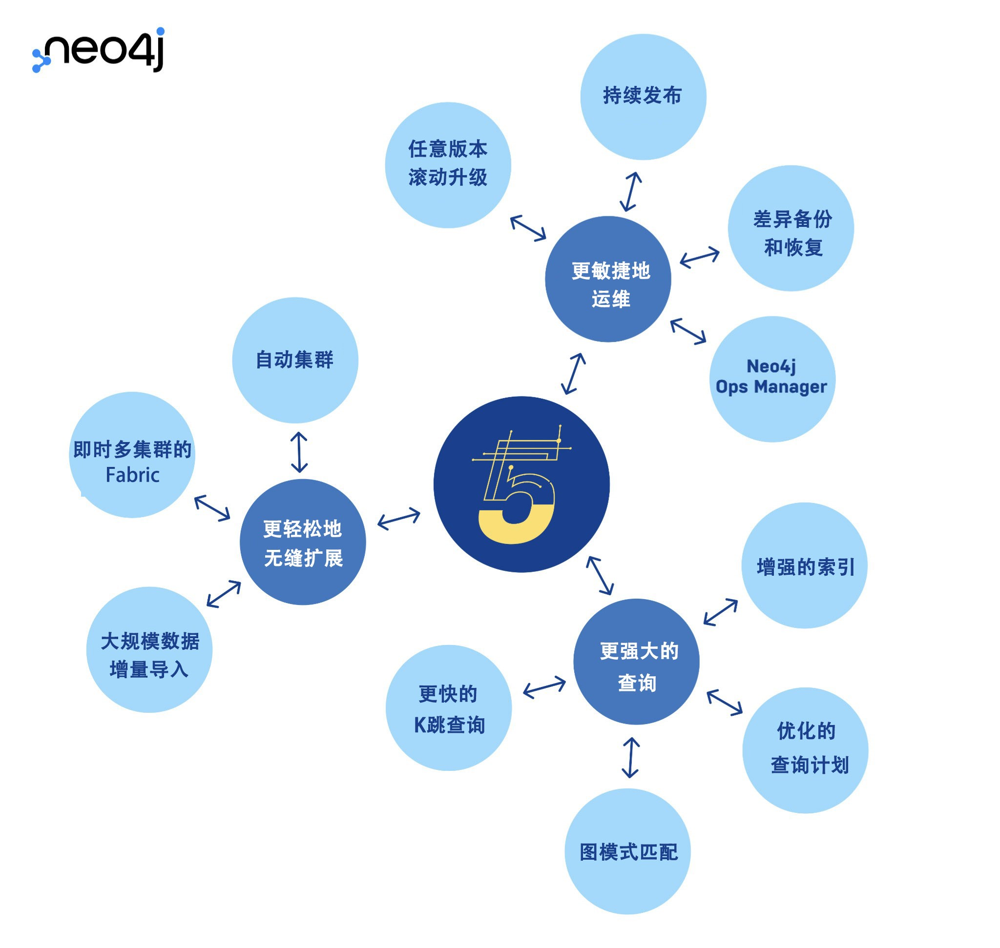

# 【报名中】11月“图无处不在”研讨会：解读下一代图数据平台 Neo4j 5

欢迎报名新的一期**Neo4j“图无处不在”关联数据系列活动**，本次活动将于【11月23日 星期三 下午4点】在腾讯会议平台举办。现在报名预留观看席位，届时可以通过腾讯会议直接入会。报名后也能第一时间掌握活动最新动态。

本次活动需要提前报名注册，积极参与互动者将有机会参与抽奖，赢得Neo4j 定制的ZIPPO 茶水分离精美保温杯一个。

活动报名链接：https://meeting.tencent.com/dw/hAAxIz6mAEP1

## Neo4j 5 正式发布

中国北京，2022年11月10日—— 图技术的领导者Neo4j 宣布下一代可用于云端的图数据平台Neo4j 5上线。在传统数据库的基础上，扩大了原生图的性能优势，同时在本地、云、混合云或多云部署中实现更高可扩展性，从而使企业能够更快地创建和部署智能应用程序，并从数据中获取更大价值。

Neo4j 联合创始人兼首席执行官 Emil Eifrem 表示：“随着企业开始寻求更好的方法利用数据连接来大规模地解决复杂问题，图技术的应用正在加速。Neo4j 5 提供更高可扩展性、敏捷性和性能的新平台，帮助企业进一步突破局限，挖掘其数据和业务的潜能。”

## 活动时间

2022年11月23日 16:00

## 活动平台

腾讯会议 Webinar

## 活动日程

16:00 **Neo4j 5 图数据库扩展极致新高度**：金昕 - Neo4j亚太区高级技术顾问

16:30 **使用Neo4j Desktop管理图数据库**：陈俊翔 - Neo4j 开发者工具团队软件开发工程师

17:00 **有奖问答互动环节**

## 讲师介绍

**金昕** —— **Neo4j 亚太区高级技术顾问**

具有15年以上的IT行业经验。曾经在Oracle，凯捷咨询，MongoDB等知名企业工作多年，具有丰富的项目设计、架构、开发和管理经验。在企业数字化和金融领域有丰富经验，并为国内外多家大型企业提供咨询服务。

**陈俊翔** —— **Neo4j DevTools 软件工程师**

2021年加入Neo4j 位于伦敦的DevTools组担任软件开发。负责开发和维护Browser、Desktop和Data Importer。目标是为Neo4j图数据库开发者提供简洁易用的工具。在此之前，任职于一家美国金融数据公司担任软件开发工程师。

> 关于 Neo4j

Neo4j 是世界领先的图数据平台。Neo4j 提供实时交易处理、先进的人工智能和机器学习以及直观的数据可视化等关联数据解决方案。我们帮助Comcast、NASA、瑞银集团和沃尔沃汽车等企业，捕获真实环境里丰富的数据上下文关系，从而解决任何规模的挑战。我们的客户通过遏制金融欺诈和网络犯罪、优化全球网络、加速突破性研究及提供更优推荐来实现其行业变革。

请访问官网 https://neo4j.com 了解更多信息。欢迎通过邮件 **china@neo4j.com** 与 Neo4j 中国团队取得联系。
