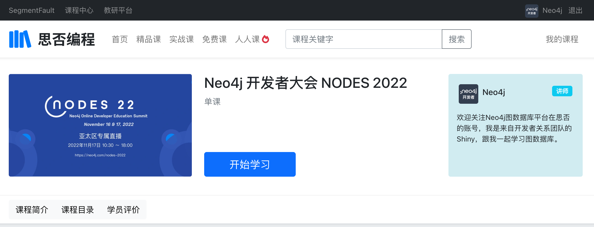
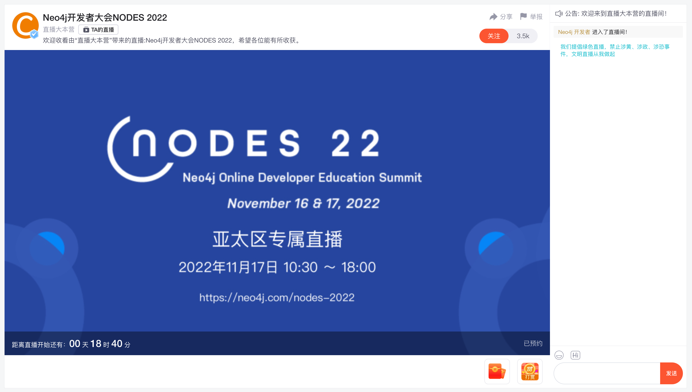

# Neo4j 全球开发者大会 NODES 2022 大中华区专属直播即将拉开序幕

各位 Graphistas：

一年一度的 Neo4j 全球开发者大会 NODES 2022 即将召开，不要错过这连续 24 小时跨越 3 个主要时区的大型在线活动，欢迎加入我们一起庆祝来自全球图技术社区的隆重分享。

## 如何参加？

本次活动使用了Hopin平台，全球的开发者和图技术爱好者都会登录此平台观看直播和互动交流。

现在还可以访问网址 <https://neo4j.com/nodes-2022> 注册参与。

活动将于北京时间2022年11月17日0点开始。

## 专属直播

为了给国内的图技术开发者们更好和更熟悉的参会体验，我们本次也跟**思否**、**CSDN**和**IT168**合作推出了专属直播。大家可以通过这三个平台直接参与，非常欢迎大家跟我们互动。

### 直播日程

本次国内的平台会全程直播基础会场的直播，请参考日程安排（SGT和北京时间是相同的，可以参考）：

### 亚太区完整日程

.jpg)

为了方便大家观看来自中国的讲师们的分享，小编已为你划好重点。

## 在思否参加NODES 2022

可通过扫描二维码打开活动页面：

## 在CSDN参加NODES 2022

可通过扫描二维码打开直播：

## 通过IT168视频号观看 NODES 2022

## 感谢合作直播平台

## 关于 Neo4j

Neo4j是全球图数据平台的领导者。我们帮助包括康卡斯特(Comcast)、美国宇航局(NASA)、瑞银(UBS)和沃尔沃汽车(Volvo Cars)等客户，捕捉数据中隐藏的现实世界丰富的上下文情境，以应对任何规模的挑战。我们的客户通过遏制金融欺诈和网络犯罪、优化全球网络、加速突破性研究和提供更好的建议来改变其所在的行业。Neo4j提供实时交易处理、先进的AI/ML、直观的数据可视化等支持。欲获得更多信息请浏览 https://neo4j.com。
