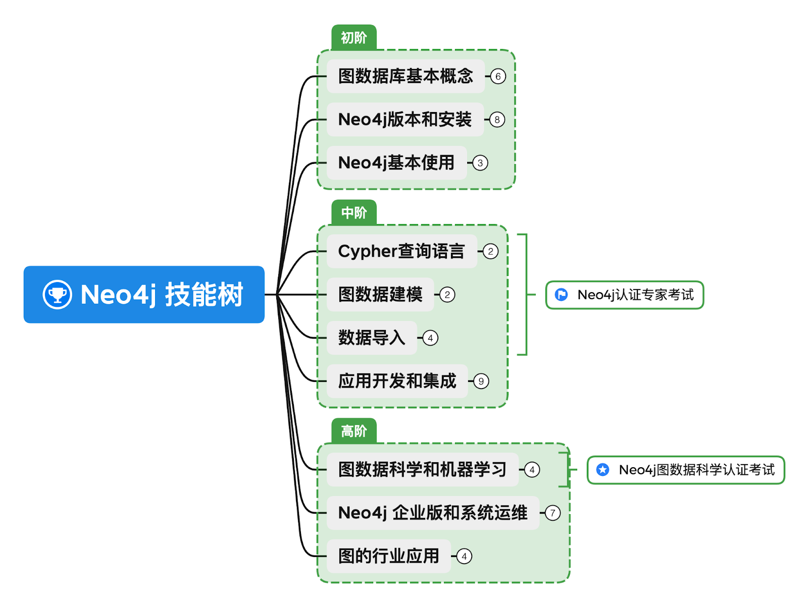

# Neo4j 中文开发者月刊 - 202209期

这是Neo4j中文开发者月刊的9月份的一期，订阅了邮件动态的伙伴是在10月8日收到。如果你想第一时间收到这份月刊，欢迎填写表单订阅。以下是月刊内容。

## 欢迎

大家好，新的一期《Neo4j 中文开发者月刊》又和你见面了。近期我们跟CSDN推出了技能树的反馈活动，给大家准备了一些小礼品，欢迎参与提交你的学习总结和意见反馈。非常感谢大家参与这个季度的GraphTalk直播活动，我们已经准备好回放视频，本期的主题是数据可视化，为你全面介绍Neo4j Bloom以及GraphXR的实战演示。

另外，预祝大家国庆假期快乐！

\- Neo4j 中文开发者月刊编辑团队 

## 开发者头条

### [在CSDN学习Neo4j技能树，发表学习心得和反馈，赢定制周边](https://bbs.csdn.net/topics/608068313)

Neo4j 技能树是CSDN的一项服务，很高兴看到超过1000人完成了Neo4j技能树的学习，非常感谢大家的热情！

为了更进一步完善和优化Neo4j技能树，我们希望听到大家的声音，所以我们准备了一些周边礼物，跟CSDN合作推出了本次活动，大家通过参与本活动就有机会领取。

我们期待收到你的反馈和建议！

## 技术文章

### [鲲鹏920+OpenEuler+毕昇JDK：Neo4j信创兼容性测试](https://blog.csdn.net/GraphWay/article/details/119778503)

作者：俞方桦 博士 - Neo4j 亚太区售前和技术总监

Neo4j是纯Java的应用软件，其版本4.x运行在JDK11环境中，可以部署在几乎所有硬件、架构和操作系统之上。那么，我们来看看Neo4j是否可以顺利运行在鲲鹏计算平台上。

### [Neo4j的事务管理和锁行为](https://blog.csdn.net/GraphWay/article/details/119778024)

作者：俞方桦 博士 - Neo4j 亚太区售前和技术总监

本文详细介绍了Neo4j的事务管理和锁行为，供大家参考。

### [《全栈 GraphQL 应用》电子书免费下载](https://neo4j.com/fullstack-graphql-applications-react-nodejs-neo4j/?ref=shiny-dev-newsletter09)

 《全栈 GraphQL 应用》是 Neo4j 开发者关系团队 William Lyon 的一本书，由 Manning 印刷出版和发行电子书。本书向您展示了如何使用 GraphQL、React、Apollo 和 Neo4j 图数据库开发全栈 GraphQL 应用程序，以及如何使用 Neo4j Aura、Auth0、Netlify 和 AWS Lambda 等现代云服务部署应用程序。

如果你想使用 GraphQL 构建超快速和超高效的 Web 应用程序，这本实用、全面的指南就是帮助你上手不可或缺的资料。

## 社区故事

### 加入 CSDN Neo4j 社区

Neo4j 官方团队正式进入中国为大家服务，我们通过本地化的交流帮助大家了解和掌握Neo4j产品。在这过程中，越来越多的开发人员和决策者跟我们取得了联系，在沟通过程中，希望大家多多参与到社区里正式的交流讨论，也能够沉淀出问题的解决方案，方便后续的搜索和分享，互助进步。

[访问 CSDN Neo4j 社区](https://bbs.csdn.net/forums/neo4j)

## 活动推荐

### Neo4j GraphTalk 与你话“图” - 探索关联数据内在之美，让您的数据绚丽绽放

信息化时代，数据之间的关联日益紧密，涵盖系统、应用等各种维度的海量数据，每时每刻都在产生。而面对源源不断的数据，如何有效地表达与传递数据背后的价值，是企业作出更精准分析决策的关键。

Neo4j Bloom 是一款突破性的美观且富有表现力的图数据可视化工具，其说明性、无代码的搜索到可视化设计使其成为促进同行和领域专家之间交流的理想界面。无论技术背景如何，图数据库新手和专家都无需编码即可快速探索并与 Neo4j 的图数据平台自由交互。Neo4j Bloom 旨在帮助用户以非常简单的方式查询和分析图数据，直观地揭示并解释连通的数据的概念，以及其中蕴藏的巨大价值。深受客户信赖和重视。

除了使用 Neo4j Bloom 来展现图数据的关联之美，你还可以使用 Neo4j 合作伙伴推出的 GraphXR 进行可视化数据探索。本期 GraphTalk 里我们特邀请到上海图客科技有限公司的专家来为大家分享，将通过 GraphXR、Neo4j Desktop 与 Neo4j Sandbox 来系统性演示基于零代码、交互式图数据可视化的金融欺诈行为检测、探索与分析，帮助大家直观理解图数据可视化探索与分析的无限可能。本期直播活动带你详细了解 Neo4j Bloom 和 GraphXR 在搜索、发现、探索和共享 Neo4j 图数据可视化的能力。无需编程经验也能开始制作图数据可视化。适合数据分析师、数据科学家、图数据爱好者、业务需求分析师，以及开发者们。

本次活动于9月28日星期三下午4点正式开始直播。希望通过本次活动的分享会给你带来启发，从而在 Neo4j 图数据可视化方面轻松应对，让数据绚丽绽放。

[立即观看回放](https://www.bilibili.com/video/BV1Yt4y1w7tg/)

---

不想错过未来的精彩内容？点击[这里](https://go.neo4j.com/china-opt-in.html)或者扫描下面的二维码马上加入。

