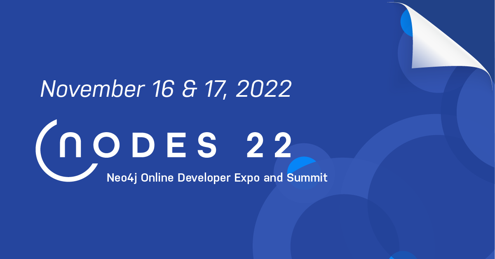

# Neo4j 中文开发者月刊 - 202210期

这是Neo4j中文开发者月刊的9月份的一期，订阅了邮件动态的伙伴是在10月29日收到。如果你想第一时间收到这份月刊，欢迎[填写这个表单](https://go.neo4j.com/china-opt-in.html)订阅。以下是本期月刊内容。

---

## 欢迎

大家好，新的一期《Neo4j 中文开发者月刊》又和你见面了。进入第四季度，技术行业和技术社区的很多大会接踵而至，我们也将出席多个活动，终于有机会跟大家面对面交流了。如果你还没有关注我们的微信公众号，请记得关注从而获得最新的消息。

这个季度我们的年度开发者大会NODES也即将到来，我们正在紧张筹备中，也为大家准备了转发邀请有奖活动，不要错过跟广大社区图技术专家的交流机会。我们也准备了一系列的工作坊，覆盖基础知识到高级运用，欢迎参与到我们一起来学习图技术。

好了，我们继续准备NODES，希望到时候可以看到你和跟我们互动。我们不见不散！

—— Neo4j 中文开发者月刊编辑团队 

## 开发者头条

### [Neo4j 开发者大会 NODES 2022 火热报名，有奖转发活动进行中](https://neo4j.com/nodes-2022/?utm_source=edm&utm_campaign=chinesedevnewsletter-202210)

Neo4j 开发者大会 NODES 2022 是为开发者和数据科学家举办的大型全球直播在线会议，NODES 2022 即将拉开序幕！锁定日期：11月16日-17日，让我们一起期待这场激动人心的精彩活动！

同时，我们正在举办邀请有奖活动。请按照以下说明邀请您的朋友参加 NODES 2022，您将有机会赢得500美元奖金！

1. 将您的拼音全名（不要带空格）添加到此URL的末尾，替换其中显示的“`fullname`”：`https://hopin.com/events/nodes-2022?utm_source=AttContest&utm_campaign=fullname`

2. 分享此完整连接给您的朋友们，确保他们使用此链接成功注册了 NODES 2022。

我们正在跟踪出席情况，请确保您的朋友注册并出席！我们活动中不见不散！

## 技术文章

### [图数据建模：关于超级节点的一切](https://blog.csdn.net/neo4jdev/article/details/127569862)

在图数据建模过程中，我们经常会碰到某些节点关联了非常多的关系，本文将讨论超级节点，它们是什么，它们引起的问题以及如何处理它们。本文是对这些问题以及它们如何具体涉及到 Neo4j 的一个摘要和总结。

### [Neo4j Fabric 快速入门](https://blog.csdn.net/GraphWay/article/details/118105211)

Fabric 是 Neo4j 4.0 中引入的新功能，是一种在多个数据库中存储和检索数据的方法。 此功能可以使用单个 Cypher 查询轻松查询同一数据库实例中的多个库/图，或多个数据库实例中的据。本文详细介绍如何配置Neo4j Fabric以及如何编写对应的 Cypher 查询。

### [《全栈 GraphQL 应用》电子书免费下载](https://neo4j.com/fullstack-graphql-applications-react-nodejs-neo4j/?ref=shiny-dev-newsletter09)

 《全栈 GraphQL 应用》是 Neo4j 开发者关系团队 William Lyon 的一本书，由 Manning 印刷出版和发行电子书。本书向您展示了如何使用 GraphQL、React、Apollo 和 Neo4j 图数据库开发全栈 GraphQL 应用程序，以及如何使用 Neo4j Aura、Auth0、Netlify 和 AWS Lambda 等现代云服务部署应用程序。

如果你想使用 GraphQL 构建超快速和超高效的 Web 应用程序，这本实用、全面的指南就是帮助你上手不可或缺的资料。

## 社区故事

### 加入 CSDN Neo4j 社区

Neo4j 官方团队正式进入中国为大家服务，我们通过本地化的交流帮助大家了解和掌握Neo4j产品。在这过程中，越来越多的开发人员和决策者跟我们取得了联系，在沟通过程中，希望大家多多参与到社区里正式的交流讨论，也能够沉淀出问题的解决方案，方便后续的搜索和分享，互助进步。

[访问 CSDN Neo4j 社区](https://bbs.csdn.net/forums/neo4j)

## 活动推荐

### Roads to NODES 工作坊系列Workshop正在进行中

探索性数据分析 (EDA) 是数据科学过程中一个成熟的步骤。 但是，很少有示例或最佳实践能够解决在图数据上执行 EDA 的独特挑战。 在本次工作坊期间，Neo4j 客户成功架构师 Daniel Bukowski 将分享执行深度图数据 EDA 的最佳实践。 还将演示使用 Neo4j 平台和 Jupyter Notebook 执行图数据 EDA 的具体步骤。参与者将带着他们可以立即应用于图数据科学项目的工具和技术投入到实际项目中。

[立即报名](https://go.neo4j.com/NODES2022TrainingSeries-GraphEDA_Registration.html)

### 社区活动：COSCon 2022 第七届中国开源年会

业界最具影响力的开源年度盛会 2022第七届中国开源年会 (COSCon'22) 将于 10月29日-30日由开源社举办。Neo4j 将作为社区合作伙伴，以及参加上海场线下开源集市，另外还有来自开发者布道师朱兴亮的演讲，不容错过。

[立即访问](https://www.bagevent.com/event/coscon)

---

不想错过未来的精彩内容？点击[这里](https://go.neo4j.com/china-opt-in.html)或者扫描下面的二维码马上加入。

