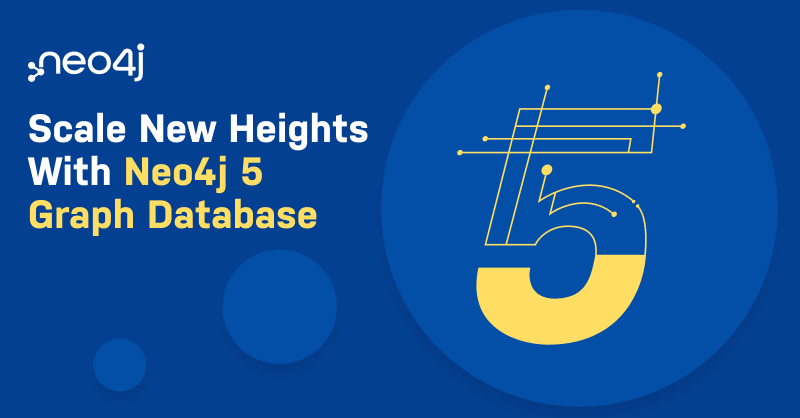

# Neo4j 中文开发者月刊 - 202211期

> 这是Neo4j中文开发者月刊的11月份的一期，订阅了邮件动态的伙伴是在11月25日收到。如果你想第一时间收到这份月刊，欢迎[填写这个表单](https://go.neo4j.com/china-opt-in.html)订阅。以下是本期月刊内容。

---

## 欢迎

大家好，新的一期《Neo4j 中文开发者月刊》又和你见面了。

各位都参加 了 Neo4j 全球开发者大会 NODES 2022 吗？我们在11月16～17成功举办了跨越3个主要时区的不间断技术直播活动，吸引了总共上万名注册和4400名参会者，还不包括中国的CSDN、思否和IT168平台的观看人数，非常感谢大家的热情参与！也非常感谢来自中国的5位讲师分享了他们的图技术经验！以及直播平台的支持，让国内的观众更容易参与到活动中。

在NODES结束后，我们也举办了11月份的“图无处不在”研讨会活动。本次活动我们介绍了Neo4j 5，和Neo4j Desktop。非常感谢大家的参与！本月还推荐了几篇技术文章，虽然有英文的，相信对大家是有帮助。

那么，现在就开始点开每个栏目，详细阅读吧。我们下一期再见。

—— Neo4j 中文开发者月刊编辑团队 

## 开发者头条

### Neo4j 宣布下一代图数据平台 Neo4j 5 上线

我们非常高兴地宣布，Neo4j 下一代图数据平台 Neo4j 5 已经全面发布。Neo4j 5在敏捷运维、自治集群和扩展、以及查询性能提升方面有着重大的改进。对于开发者来说，它提供了更友好、更容易的方法来编写具有更强表现力的 Cypher 查询。通过K跳查询优化以及增强的索引，相对于关系型数据库的性能优势得到大幅提高。同时，社区版提供了一个升级版的运行时，使查询速度提高了30%。在Python驱动中支持 Pandas 数据框架，使得导出的Neo4j结果集可以整合到数据科学家的普通工作流中。

Neo4j 5 在传统数据库的基础上扩大了原生图的性能优势，同时在本地、云、混合云或多云部署中实现更高可扩展性，从而使企业能够更快地创建和部署智能应用程序，并从数据中获取更大价值。

现在就[下载](https://neo4j.com/download-center/)或[免费注册 Neo4j AuraDB](https://neo4j.com/cloud/aura)开始体验吧。阅读[介绍文章](https://mp.weixin.qq.com/s/6lZ_1ZQ4B-knm3eB-DhwtA)。

## 技术文章

### Neo4j 5的自治图数据库集群

本文使用详细案例介绍和演示了如何使用Neo4j 5的自治集群，Neo4j 5 中的自治集群使得构建高度可靠的集群变得容易，这些集群可以处理大量并发工作负载，水平扩展以满足企业级应用程序的需求。

欢迎从下载中心下载 Neo4j 5并查看操作手册中的自治集群文档来开始使用。

[阅读原文](https://blog.csdn.net/GraphWay/article/details/128026639)

### Neo4j 图数据库入门2023版：第1章 - 关系（英文）

以下是你需要了解的关于Neo4j图数据库的最重要的事情。图方法学被有意设计成尽可能接近于你在白板上画出的信息概念模型，你会把它传达给其他人。你在脑海中可视化数据的方式，构成了图数据库的基础。如果你有一个还不是图数据库的数据库，一旦你为它建立了一个概念模型，你的大部分图解工作就完成了。

[阅读原文](https://neo4j.com/developer-blog/neo4j-graph-databases-for-beginners-2023-edition-chapter-1-relationships/)

### 什么是图嵌入？如何解决更大规模的问题（英文）

“图嵌入”还不是一个常用的短语，至少在信息技术领域还不是。目前，它更像是一个数据科学用语，是从数学家的剧本中借用的。（斯坦福大学教授更喜欢“表示学习”这个词。）作为一种技术本身，它并不是特别创新。您可能会争辩说，大约在公元前 5 世纪，希腊建筑师米利都的伊西多尔发现了阿基米德设计背后的几何参数，并在其他地方以不同比例在新建筑中重新创建了它们，某种形式的图形嵌入就诞生了。

它的想法是，在某种形式下，当解决方案可以直观地表示为图形时，这些解决方案的关键几何组件可以映射到更小规模、更紧凑的矩阵——甚至是另一个图形——而不会显着降低精度。就我们的目的而言，图嵌入实现了这一点：使用一个非常大且密集的值矩阵，其排列对它们有一定的组织，使它们能够被绘制成一个图，组织这些值的组件可以映射到一个较小的数字的值或向量，可以使我们获得基本相同的结果。

[阅读原文](https://neo4j.com/developer-blog/graph-embedding-solve-bigger-problems-scale/)

## 社区故事

## 

### 感谢各位社区讲师在 NODES 2022 上的精彩分享

Neo4j 开发者大会 NODES 2022 于11月16~17日全球同步直播，这是一场覆盖3个主要时区的不间断技术大会，有近1万名注册和总计 4400 名参会者，整个活动获得了8.9分（满分10分）。亚太区专场于17日10:30～18:00期间进行，来自中国的5位讲师分享了各自在图技术领域的经验。感谢大家的精彩演讲！

同时也感谢CSDN、思否和IT168的同步直播，为国内的开发者和图技术爱好者提供了更直接的参与。

目前基础会场的回放已经发布，各个演讲的视频也正在处理中，大家可以访问回放列表查看，敬请收藏，我们会持续更新这个播放列表。

[收藏观看和推荐 NODES 2022 回放](https://www.youtube.com/playlist?list=PL9Hl4pk2FsvWPcphew_GbLjCWvMpmh4mV)

### CSDN 学习 Neo4j 技能树有奖反馈活动结束

在上个月，我们跟CSDN一起发布了“学习 Neo4j 技能树，发表反馈博客”有奖活动，总计收到了9份反馈内容。非常感谢大家的参与。目前已经安排了奖品寄送。希望大家持续关注 Neo4j 并将图技术运用于工作和生活中。

也非常环境大家推荐 Neo4j 技能树，我们也在更新下一个版本。感谢大家的反馈和建议！

[学习Neo4j技能树，发表学习心得和反馈，赢定制周边](https://bbs.csdn.net/topics/608068313)

### 加入 CSDN Neo4j 社区

Neo4j 官方团队正式进入中国为大家服务，我们通过本地化的交流帮助大家了解和掌握Neo4j产品。在这过程中，越来越多的开发人员和决策者跟我们取得了联系，在沟通过程中，希望大家多多参与到社区里正式的交流讨论，也能够沉淀出问题的解决方案，方便后续的搜索和分享，互助进步。

[访问 CSDN Neo4j 社区](https://bbs.csdn.net/forums/neo4j)

## 活动推荐

### 使用 Neo4j 从图中获得无限规模的数据洞察力

世界各地的组织都面临着如何从他们每天收集的大量数据中获取最大价值的挑战。为了应对这一挑战，Neo4j 发明了一个数据库，其中关系是一等公民，从而实现了一种新型分析，可以为创新业务模型提供快速洞察。基于其图数据库的卓越性能，下一代 Neo4j 数据库在您选择的云中运行非常大的图和多租户集群时可立即提供结果。

加入我们，享受这个激动人心的机会，听取 Neo4j 专家的意见，了解这个下一代图数据库如何将图性能提升到前所未有的规模。Neo4j 欧洲、中东和非洲地区销售副总裁 Rik Van Bruggen 和 Neo4j 图数据库产品经理 Ivan Zoratti 将在这 45 分钟的会议中与您联系，讨论：

- 为什么图数据库在性能、规模和可操作性方面优于关系数据库
- Neo4j 图数据库如何解决您最困难的数据洞察挑战
- 为什么图用例的规模和范围不断扩大

[立即报名](https://go.neo4j.com/WBR-221208-Neo4j-5-APAC_Registration2.html)

---

不想错过未来的精彩内容？点击[这里](https://go.neo4j.com/china-opt-in.html)或者扫描下面的二维码马上加入。

